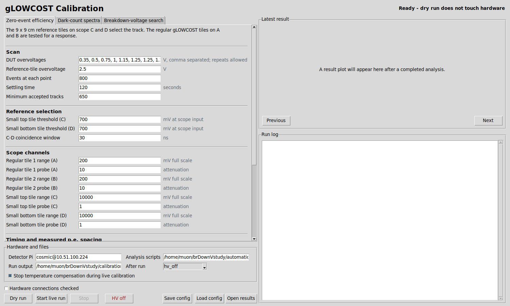
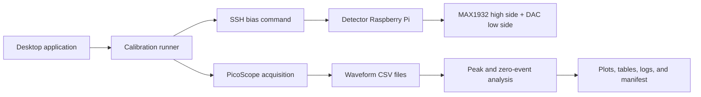

# SiPM Calibration with PicoScope Automation

This repository contains the acquisition, analysis, and hardware-control software used to calibrate the SiPM channels of the gLOWCOST cosmic-ray muon detector. It brings three measurements into one reproducible workflow:

1. **Breakdown-voltage scan** from the separation of photoelectron peaks.
2. **Dark-pulse scan** at selected overvoltages.
3. **Particle-triggered zero-event scan** for the efficiency of the complete scintillator, wavelength-shifting fiber, SiPM, and readout chain.

The graphical application is intended for the Ubuntu computer connected to the PicoScope. Bias commands are sent over SSH to the detector Raspberry Pi. Dry-run mode uses synthetic waveforms and does not touch either instrument.

Hover over a setting or action button for a short explanation of what it controls, the expected units, and its effect on acquisition or detector hardware.



> **Hardware warning:** the bias-control constants in `pi/` are measurements from one readout. Do not use them on another detector until its MAX1932 and DAC transfer functions, channel mapping, SiPM breakdown voltages, and temperature sensor have been checked. A voltage reported by software is a calculated value, not an independent voltage readback.

## What The Software Does



Each run gets its own time-stamped directory. The saved configuration, environmental readings, hardware plans, raw waveforms, analysis tables, plots, command logs, and final hardware state remain together.

## Quick Start

The commands below are for the Ubuntu acquisition computer.

```bash
git clone https://github.com/tharinduudu/SiPM-callibration-picoScope-Automation.git
cd SiPM-callibration-picoScope-Automation
./app/install_desktop.sh
./app/launch.sh
```

Before connecting to hardware, run the tests:

```bash
make check
```

Open the application, select **Dry run**, and run each workflow once. Dry-run output is written below `~/brDownVstudy/calibration_runs` by default.

Live mode requires all of the following:

- the PicoSDK system libraries and a supported PicoScope;
- passwordless SSH from the acquisition computer to the detector Pi;
- the Pi-side scripts in `pi/`, installed and calibrated for that detector;
- correct probe attenuation and channel mapping;
- the typed confirmation `RUN_LIVE_HARDWARE`.

The default final state is **HV off**, including after Stop or most failures.

## Repository Map

| Path | Purpose |
|---|---|
| `app/` | Tkinter interface, workflow runner, validation, plots, and tests |
| `automation/` | PicoScope acquisition and scientific analysis programs |
| `pi/` | Raspberry Pi bias planning and application programs |
| `docs/` | Installation, operation, method, safety, formats, and development notes |
| `requirements.txt` | Python dependencies for the acquisition computer |
| `Makefile` | Repeatable compile, unit-test, and synthetic-test commands |

## Documentation

- [Installation and instrument setup](docs/INSTALLATION.md)
- [Operator guide](docs/OPERATOR_GUIDE.md)
- [Scientific method](docs/SCIENTIFIC_METHOD.md)
- [Pi bias-control calibration](docs/PI_BIAS_CONTROL.md)
- [Data and result formats](docs/DATA_FORMAT.md)
- [Safety and failure recovery](docs/SAFETY.md)
- [Troubleshooting](docs/TROUBLESHOOTING.md)
- [Software architecture and development](docs/DEVELOPER_GUIDE.md)
- [Validation record](docs/VALIDATION.md)
- [Primary references](docs/REFERENCES.md)

## Important Scientific Limits

- The p.e.-spacing method estimates avalanche breakdown voltage by extrapolating gain to zero. It does not, by itself, select the best operating overvoltage.
- Equal overvoltage improves gain matching, but it does not guarantee identical photon-detection efficiency, dark-count rate, optical coupling, or scintillator response.
- The zero-event scan measures the response of the complete detector channel under a reference-particle selection. Its result depends on reference geometry, thresholds, waveform windows, and statistics.
- The self-triggered dark workflow records triggered pulses. Its observed capture rate is not an absolute, dead-time-corrected dark-count rate unless acquisition live time and trigger dead time are independently accounted for.
- Saturated or overflowed traces must not be used for p.e. peak spacing.

## Command-Line Use

Every workflow can be run without the interface. First save a configuration from the application, then use:

```bash
python3 app/calibration_runner.py vbr_search --config calibration_config.json --dry-run
python3 app/calibration_runner.py dark_count --config calibration_config.json --dry-run
python3 app/calibration_runner.py zero_event --config calibration_config.json --dry-run
```

Live execution adds both `--live` and the confirmation string:

```bash
python3 app/calibration_runner.py zero_event \
  --config calibration_config.json \
  --live --confirm RUN_LIVE_HARDWARE
```

Read [SAFETY.md](docs/SAFETY.md) before using this command.

## Raw Data Policy

Raw waveform captures are deliberately excluded from Git because a single scan can contain tens of thousands of CSV files. Store raw runs on laboratory storage, keep the generated `configuration.json` and `manifest.json` with them, and commit only selected plots, compact result tables, and documented example data when they are scientifically useful.

## Project Status

The acquisition and analysis chain has unit tests and complete synthetic dry runs. Hardware-specific bias constants are preserved for traceability, but commissioning on a new detector always requires independent voltage measurements and a short low-risk validation scan.
