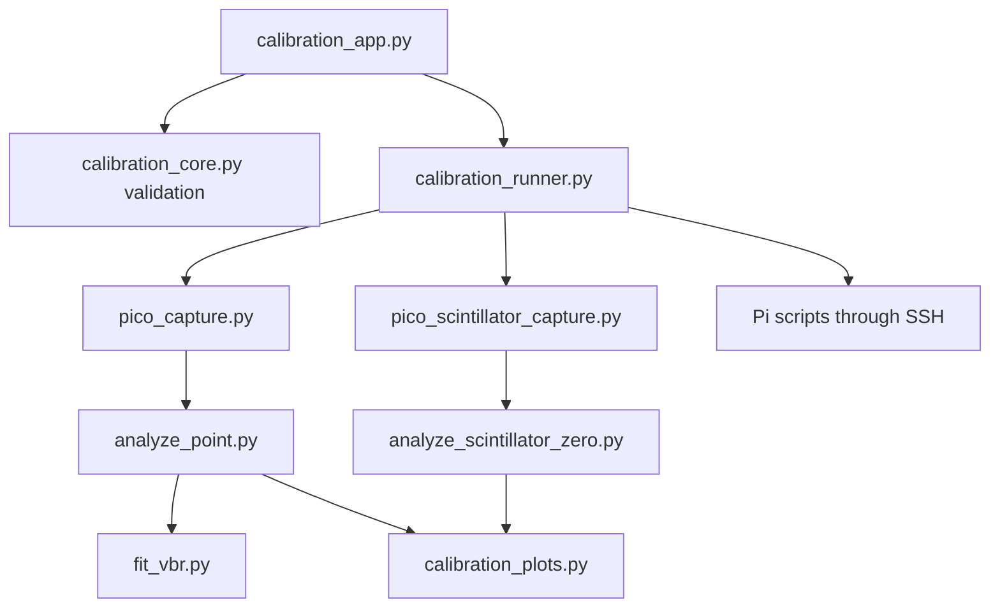

# Developer Guide

## Design Goals

The code is split into small command-line programs so that each scientific stage can be inspected and rerun without the graphical interface. The GUI edits configuration and starts a runner; it does not contain the analysis mathematics.



## Modules

### Desktop application

- `calibration_app.py`: Tkinter controls, state, start/stop actions, and log/plot display.
- `calibration_core.py`: configuration parsing, validation, logging, cancellable child processes, and JSON helpers.
- `calibration_runner.py`: run lifecycle, hardware lock, SSH calls, acquisition-analysis sequencing, manifest updates, and finalization.
- `calibration_plots.py`: workflow-level summary plots.

### Acquisition and analysis

- `pico_capture.py`: one-channel self-triggered block capture and synthetic p.e. waveforms.
- `pico_scintillator_capture.py`: four-channel reference coincidence capture and synthetic efficiency events.
- `analyze_point.py`: event baseline, pulse height/area, p.e. peak fits, and point quality.
- `fit_vbr.py`: weighted p.e.-spacing line fit and Vbr covariance propagation.
- `analyze_scintillator_zero.py`: reference selection, signal/dark charge gates, zero-event efficiency, and posterior uncertainty.
- `zero_event_monitor.py`: lightweight read-only progress and waveform monitor.

### Pi hardware control

The files in `pi/` are intentionally separate from the desktop environment. Their constants are detector-specific and their live path is `/home/cosmic` in the current deployment.

## Configuration Flow

`calibration_defaults.json` is loaded by the GUI. The UI updates a copy, validates the selected workflow, and writes a temporary or user-selected JSON file. The runner loads and validates it again before creating a run. The exact final configuration is copied to the run directory.

Relative `automation_dir` paths are resolved relative to `app/`. User-home markers in output paths are expanded. This lets the default `../automation` work regardless of the terminal's current directory.

## Adding A Setting

1. Add a conservative default to `calibration_defaults.json`.
2. Add its UI field and load/store code in `calibration_app.py`.
3. Validate it in `calibration_core.py` before any hardware operation.
4. Pass it explicitly from `calibration_runner.py` to the command-line program.
5. Record it in output metadata.
6. Add a unit test for invalid values and a smoke-test path.
7. Document units, physical meaning, and safe range.

Avoid hidden constants in the GUI. A number affecting scientific selection should be present in configuration, output metadata, or both.

## Adding A Workflow

Keep the lifecycle consistent:

1. validate all settings;
2. acquire the local hardware lock;
3. create a unique run directory;
4. write configuration and manifest;
5. preflight scope/SSH;
6. stop competing control processes;
7. record environment;
8. set bias and save the returned plan;
9. settle;
10. acquire raw data;
11. analyze without deleting raw data;
12. update point status;
13. produce summary plots;
14. record the environment again;
15. enter the configured final hardware state in `finally`.

## Testing

```bash
make compile
make test
make smoke
```

`make smoke` creates temporary synthetic data for all workflows. To inspect the temporary output, run the workflow directly with a configuration whose `output_root` is a persistent test folder.

Hardware tests should begin with the `--probe` action and a single low-event point. They are not part of automated continuous integration because they require a specific scope and detector.

## Coding Style

- Keep command-line programs independently runnable.
- Prefer explicit names with units, such as `trigger_mv` and `sample_interval_ns`.
- Keep comments for physical reasoning, safety ordering, or non-obvious statistics.
- Preserve raw inputs and record why points were rejected.
- Do not silently repair scientific data.
- Raise an error before hardware access when configuration is invalid.
- Put detector-specific calibration values in one visible location.

## Release Checklist

- Run `make check`.
- Test a dry run from the GUI.
- Confirm documentation matches defaults.
- Review `git diff` for IP addresses, passwords, and raw data.
- Confirm no detector-specific change is presented as universal.
- On the lab computer, perform scope probe and SSH preflight.
- Tag releases used for a reported result.
