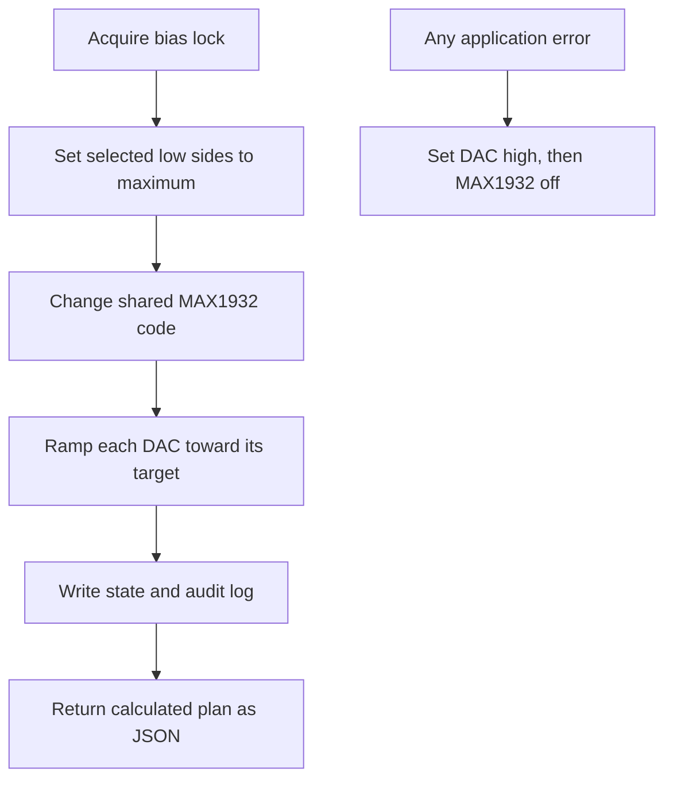

# Raspberry Pi Bias Control

## Effective-Bias Model

The SiPM is biased between a shared programmable high side and a channel-specific programmable low side:

\[
V_{\mathrm{bias},i}=V_{\mathrm{high}}-V_{\mathrm{low},i}.
\]

The MAX1932 provides coarse high-side control. A 10-bit DAC provides fine low-side control for each SiPM. The software searches for a shared high-side code and one low-side code per channel that reproduce the requested effective biases.

This repository currently preserves the measured equations from detector `10.51.100.224`:

\[
V_{\mathrm{high}}=103.5470864-0.1952125\,C_{\mathrm{MAX}}
\]

for MAX1932 codes `0x45` through `0xFF`, and

\[
V_{\mathrm{low}}=0.0005+2.9968\frac{C_{\mathrm{DAC}}}{1023}.
\]

One DAC least-significant bit is therefore approximately

\[
\frac{2.9968\ \mathrm{V}}{1023}=2.93\ \mathrm{mV}.
\]

These equations are calibration data, not universal component specifications.

## Why A Shared High Side Is Important

All selected channels share one MAX1932 setting. The code cannot independently choose a coarse voltage for each SiPM. It searches all calibrated MAX1932 codes and rejects combinations that would put a low-side DAC too close to either rail. Among sufficiently accurate solutions, it prefers DAC values near the middle of their range so temperature compensation retains adjustment room.

## Safe Setting Sequence

The Pi controller performs the following sequence:

Putting the low side at maximum first reduces effective SiPM bias while the high side changes. The DAC then moves in small code steps with a delay. This sequence reduces abrupt bias changes but is not a substitute for overvoltage or overcurrent hardware protection.

## Files

- `vbr_bias_control.py`: plans or sets one absolute bias for selected channels, reads the environment, reports status, and switches HV off.
- `set_dual_operating_point.py`: applies separate temperature-corrected breakdown voltages to two channels at one common overvoltage.
- `set_four_channel_efficiency_scan_bias.py`: keeps two reference channels fixed while scanning two device-under-test channels.

## Recalibrating The High Side

1. Disconnect or protect SiPMs as required by the readout procedure.
2. Set the low side to a documented condition.
3. Apply a sequence of MAX1932 codes across the intended linear region.
4. Measure the physical high-side voltage with a suitable meter.
5. Fit `Vhigh = intercept + slope * code` and inspect residuals.
6. Do not include a nonlinear or unstable region merely to increase the number of points.
7. Replace `MAX_INTERCEPT_V`, `MAX_SLOPE_V_PER_CODE`, and the valid code range only for the detector that was measured.
8. Verify several codes not used in the fit.

The MAX1932 code direction in this system is inverted: increasing the code decreases high-side voltage. Always verify direction experimentally after changing firmware or hardware.

## Recalibrating The DAC

1. Hold the high side fixed or off according to the measurement procedure.
2. Apply DAC codes covering `0x000` through `0x3FF`.
3. Measure the low-side voltage at the channel being calibrated.
4. Fit the transfer function and inspect channel-to-channel differences.
5. Update the offset/span model if one common calibration is justified; otherwise extend the controller to use per-channel constants.
6. Check that the effective-bias error remains within roughly half one DAC LSB after quantization.

Do not use the text printed by `dac.py` as the calibration measurement. That message is generated by software and can repeat the same model being tested.

## Temperature Correction

For a stored breakdown voltage at reference temperature \(T_0\), the planned breakdown voltage at temperature \(T\) is

\[
V_{br}(T)=V_{br}(T_0)+k_T(T-T_0).
\]

The four-channel script currently uses `0.054 V/°C`. This is a starting coefficient and must be measured or validated for the SiPM type and readout. The temperature must represent the SiPM, not merely warm air near the Raspberry Pi.

Temperature compensation must be stopped during a controlled bias scan. Otherwise two programs can fight over the DAC. The desktop runner stops `biasAdj.py` before live scans when configured to do so.

## Detector-Specific Values

`DEVICES` in `set_four_channel_efficiency_scan_bias.py` contains channel roles, breakdown voltages, and reference temperatures. Before deployment, replace these with traceable values from the SiPMs currently installed. Record any channel swap immediately; a correct number assigned to the wrong SiPM is still a wrong bias.

## Readback Limitation

The present readout calculates voltage from command codes. It does not independently digitize the actual high-side and low-side voltages. Every live JSON record should therefore be read as a **planned/calculated bias**. Commissioning and periodic checks require a meter or a dedicated voltage-monitor ADC.
